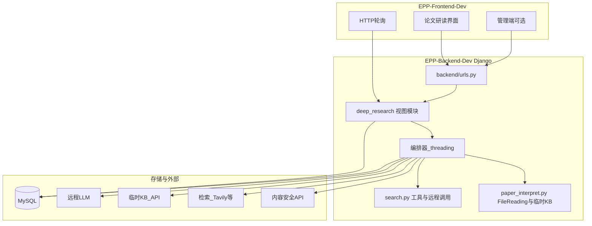
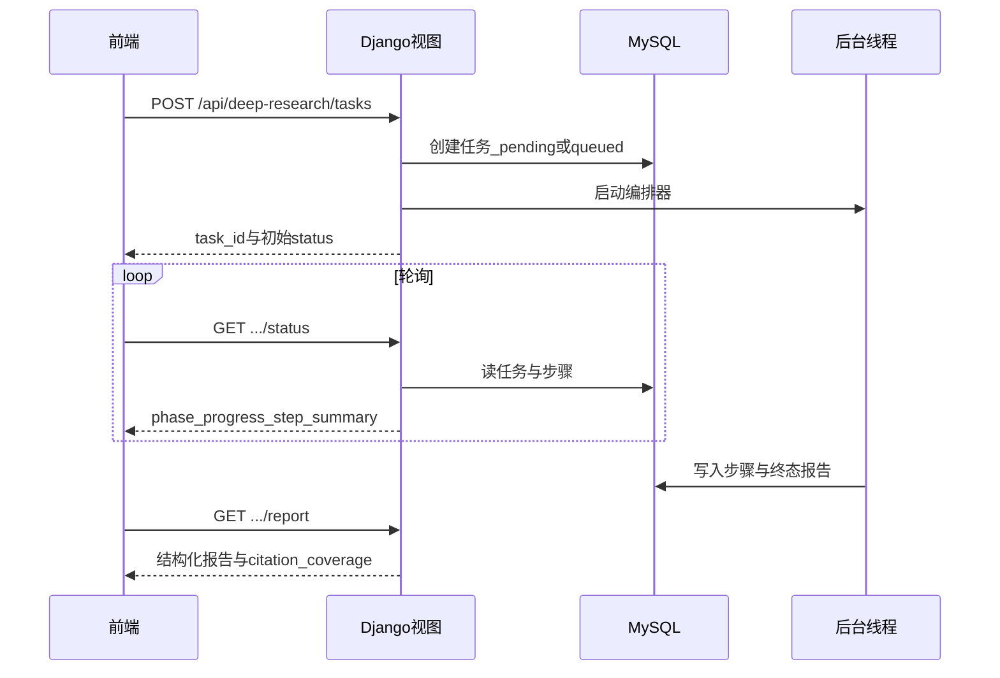
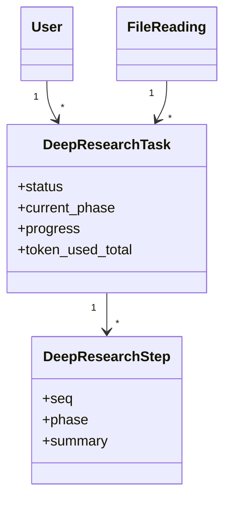

# Deep Research 链路设计总览（最终版）

> **文档性质**：在 [`FR-traceability-matrix.md`](./FR-traceability-matrix.md)、[`openapi-deep-research.yaml`](./openapi-deep-research.yaml)、[`data-model-and-states.md`](./data-model-and-states.md) 等分册基础上整理的**单一入口总览**，便于评审与落地对照。  
> **规格依据**：《学术文献科研助手》EPP-FR-1 v2.0（如 FR-AIMK-0004、FR-YHJH-0010、FR-SJGL-0006–0009、4.4.5 等）。

---

## 1. 设计目标与边界

### 1.1 目标

- 在**论文研读**场景下，提供超越普通对话的「深度研究」能力：多轮 **规划 → 检索 → 阅读 → 反思**，产出带**循证引用**的结构化长篇调研报告，并支持左侧 PDF 锚点跳转、追问与局部重生成、结构化导出（Markdown/PDF/批量 ZIP）。
- 管理端具备**任务监控、执行轨迹、配额与 Token、合规审计、强制中断/屏蔽、终态归档与审计**等能力（对应 FR-SJGL-0006–0009）。
- 非功能上满足 **4.4.5**：思考链可见、循证覆盖、单任务熔断与资源释放、并发与排队体验（目标含平滑排队；并发指标可分阶段逼近）。

### 1.2 边界（做什么 / 不做什么）

| 范围内 | 范围外（本链路不单独承担） |
|--------|---------------------------|
| 单文献研读上下文下的 Deep Research 任务与报告 | 「科研智能助手」通用网页自动化全链路（FR-KYZS-*）——可**共享配额/审计**，但任务类型与入口不同 |
| HTTP 轮询驱动的长任务 + DB 持久化状态 | 首版不强制 **SSE/WebSocket**、**Celery/独立 worker** |
| 用户端导出、个人中心对 DR 类型的标识/筛选（与实现联调） | 前端 UI 视觉稿细部 |

---

## 2. 与现有系统关系

### 2.1 架构总览

### 2.2 可复用代码与模式

| 类别 | 位置 | 复用方式 |
|------|------|----------|
| 路由与视图风格 | [`backend/urls.py`](../../../EPP-Backend-Dev/backend/urls.py) | 新增 `path("api/deep-research/...", ...)`；函数视图 + `JsonResponse` |
| 响应封装 | [`business/utils/response.py`](../../../EPP-Backend-Dev/business/utils/response.py) | `ok` / `fail` / `unauthorized`；业务 `code` 见 [`error-codes.md`](./error-codes.md) |
| 鉴权 | [`business/utils/authenticate.py`](../../../EPP-Backend-Dev/business/utils/authenticate.py) | `@authenticate_user` |
| 长任务模式 | [`business/api/search.py`](../../../EPP-Backend-Dev/business/api/search.py) | **后台线程 + DB 状态 + 轮询**；DR 与之对齐，避免引入新队列中间件 |
| 研读上下文 | [`business/api/paper_interpret.py`](../../../EPP-Backend-Dev/business/api/paper_interpret.py) | `FileReading`、`tmp_kb_id` 映射、`get_tmp_kb_id` |
| 远程模型与密钥 | [`backend/settings.py`](../../../EPP-Backend-Dev/backend/settings.py) | `REMOTE_MODEL_BASE_PATH`、`TAVILY_API_KEY` 等 |

---

## 3. 技术选型

| 维度 | 选型 | 说明 |
|------|------|------|
| Web 框架 | Django（现有） | 不强制引入 DRF |
| 长任务 | `threading` + 数据库状态 | 与 `search.py` 一致 |
| 实时性 | HTTP 轮询；可选 `GET .../events?since_seq=` | 满足 4.4.5 可见性；SSE 为远期可选项 |
| 存储 | MySQL + JSON 字段存报告（或对象存储大对象） | 归档可后续做历史表/分区 |

---

## 4. 执行链路设计

---

## 5. 逻辑模型

---

## 6. 接口定义

### 6.1 用户端

| 方法 | 路径 | 说明 |
|------|------|------|
| POST | `/api/deep-research/tasks` | 创建任务 |
| GET | `/api/deep-research/tasks/{task_id}/status` | 轮询状态 |
| GET | `/api/deep-research/tasks/{task_id}/events` | 可选增量步骤 |
| GET | `/api/deep-research/tasks/{task_id}/report` | 终态报告 |
| POST | `/api/deep-research/tasks/{task_id}/follow-up` | 追问/局部重生成 |
| POST | `/api/deep-research/tasks/{task_id}/abort` | 中止 |
| POST | `/api/deep-research/tasks/export` | 批量导出 MD/PDF/ZIP |

### 6.2 管理端

| 方法 | 路径 | 说明 |
|------|------|------|
| GET | `/api/manage/deep-research/tasks` | 列表与筛选 |
| GET | `/api/manage/deep-research/tasks/{task_id}/trace` | 执行轨迹 |
| POST | `/api/manage/deep-research/tasks/{task_id}/force-stop` | 强制中断 |
| POST | `/api/manage/deep-research/tasks/{task_id}/suppress-output` | 屏蔽输出 |

---

## 7. 数据流

1. **创建**：校验登录、`file_reading` 归属、综述完成态（规格 3.7.4.2）、配额 → 写 `DeepResearchTask` → 抢并发槽或 `queued`。
2. **执行**：编排器循环写 `DeepResearchStep`，更新 `current_phase` / `progress` / `step_summary`，累计 Token。
3. **合规**：阶段性或终局扫描 → 可进入 `violation_pending`。
4. **报告**：生成结构化 JSON + `citation_coverage`；不达标则拦截或 `needs_review`（策略可配置）。
5. **导出**：按 `task_ids` 与 `format` 生成文件或异步 `export_job_id`。
6. **归档**：终态后审计汇总 → `archived` 或迁历史表。

---

## 8. 落地设计

### 8.1 新增

| 类型 | 内容 |
|------|------|
| 模型 | `DeepResearchTask`、`DeepResearchStep`；可选合规/审计归档表 |
| 迁移 | Django `makemigrations` |
| API 模块 | 建议 `business/api/deep_research.py`（或拆分子模块） |
| 编排器 | 建议 `business/services/deep_research_orchestrator.py`（或 `business/utils/` 下） |
| 路由 | [`urls.py`](../../../EPP-Backend-Dev/backend/urls.py) 增加 `api/deep-research/*` 与 `api/manage/deep-research/*` |
| 配置项 | 如 `DR_MAX_CONCURRENT`、`DR_TOKEN_BUDGET_PER_TASK`（可放 `settings` 或管理端配置表） |

### 8.2 扩展

| 类型 | 内容 |
|------|------|
| `paper_interpret` | 仅在确认生命周期后调用 `delete_tmp_kb`；建议对 DR 专用缓存与研读 KB **引用计数** |
| `search` 工具 | 以**函数调用**或 HTTP 客户端复用，避免嵌套多层后台线程 |
| 用户配额 | 与用户层级、管理端配额（FR-SJGL-0007）对接，可能扩展 `User` 或独立配额表 |
| 个人中心/对话列表 | 增加 `conversation_type = deep_research` 或与 `task_id` 关联（FR-GRXX-0006） |

### 8.3 子任务

| 子任务 | 重点 |
|--------|------|
| M1 | 模型 + 用户 API + 轮询占位 |
| M2 | 编排闭环 + 工具集成 |
| M3 | 循证 + 导出 |
| M4 | 管理端 + 合规 + 归档 |
| M5 | 队列 UX + 性能与观测加固 |