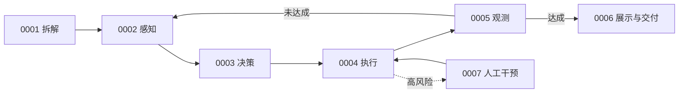
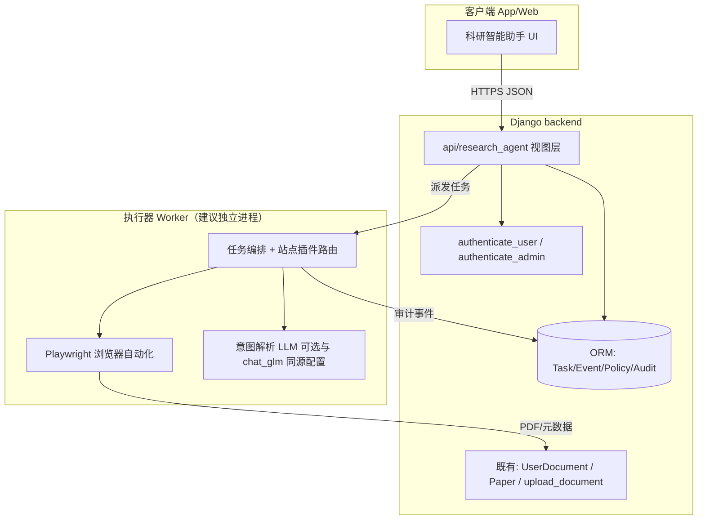
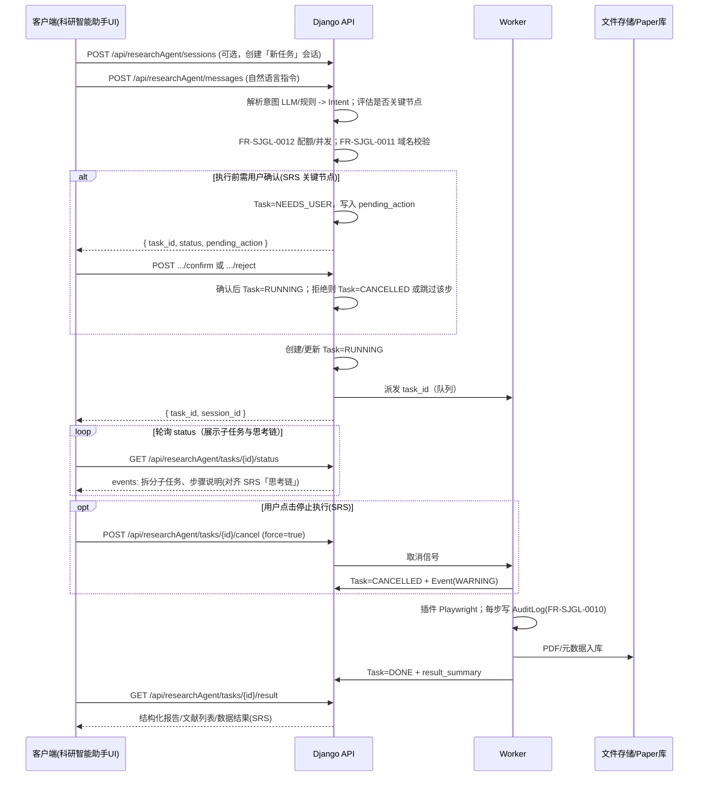

# 科研智能 AI 助手模块 — 概要设计说明书

| 项目           | 说明                                                                                                 |
| -------------- | ---------------------------------------------------------------------------------------------------- |
| 模块范围       | 用户端：自然语言下达任务、执行计划预览与二次确认、进度与结果；管理端：站点策略、审计日志、限流与并发 |
| 关联迭代       | 《学术文献科研助手》迭代开发 — 第5部分「科研智能 AI 助手」（类网页自动化能力）                       |
| 工程基线       | Django 后端 `business` 应用；认证 `business.utils.authenticate`；响应封装 `business.utils.response`  |
| 文档依据       | **`学术文献科研助手-正式发布2.docx`**                                                                |
| 模块 SRS 位置  | **§3.8 科研智能助手模块需求**                          |
| 用户端功能编号 | **FR-KYZS-0001～0007**；管理端 **FR-SJGL-0010～0012**                                                |

---

## 0. SRS 需求追溯


### 0.1 用户端：科研智能助手模块（§3.8，FR-KYZS-0001～0007）

| 编号             | SRS 名称           | 概要设计中的落点                                                                                                     |
| ---------------- | ------------------ | -------------------------------------------------------------------------------------------------------------------- |
| **FR-KYZS-0001** | 自主拆解任务       | LLM/规则生成**可执行原子任务大纲**与拓扑；严重缺失时**追问**补全；持久化 `task_graph_json` / `intent_json`           |
| **FR-KYZS-0002** | 感知环境状态       | 探测网络、站点限制、**用户算力配额**、对话上下文与前序中间结果；**状态同步前端**（`ResearchAgentEvent`，可叠加 SSE） |
| **FR-KYZS-0003** | 决策行动路径       | **API 直调** vs **网页自动化**；预估成功率/耗时；输出**插件级指令流**（受控工具，非任意站点自主爬）                  |
| **FR-KYZS-0004** | 自动化工具执行     | Playwright / 既有 HTTP 下载等；**安全自检**→ 挂起；**操作留痕**→ `ResearchAgentAuditLog`                             |
| **FR-KYZS-0005** | 观测执行反馈       | 收集 DOM/下载/脚本输出；**未达成**则回到 **0002** 再循环；达成则交付整理                                             |
| **FR-KYZS-0006** | 状态展示与成果交付 | **稳定实时链路**推送步骤；成果：**卡片 / Markdown**；引导收藏、笔记、新对话（前后端协同）                            |
| **FR-KYZS-0007** | 高风险动作人工干预 | 批量下载、高算力、未知外链等：**挂起 + 断点**；允许 / 终止 / **方向微调**；**超时未响应→休眠**（`DORMANT`）          |

**UI 补充（可继承 3.5 原型或 UI 说明）**：主页唤起、悬浮入口、历史会话列表等由**前端详细设计**覆盖，后端以 `session_id` / 消息序列 API 支撑。

**闭环（0002→0005，对应 SRS）：**



### 0.2 管理端：与科研助手直接相关的数据管理功能

| 编号             | 名称               | 概要设计中的落点                                                                                                                        |
| ---------------- | ------------------ | --------------------------------------------------------------------------------------------------------------------------------------- |
| **FR-SJGL-0010** | 科研助手行为审计   | `ResearchAgentAuditLog`；筛选维度：用户 ID、任务 ID、域名、操作类型、异常状态；支持**一键导出结构化文档**（如 CSV/JSON，可选 PDF 汇总） |
| **FR-SJGL-0011** | 目标站点访问管控   | `ResearchAgentSitePolicy`；**白名单/黑名单模式**；手动添加或批量导入；受限站点访问时**任务挂起**并向管理端上报拦截事件                  |
| **FR-SJGL-0012** | 访问频率与并发限制 | 全局并发上限、分用户等级；接近阈值时**排队或降级**；预警通知管理员；与 Worker 内令牌桶/队列实现对应                         |

> 说明：**FR-SJGL-0006～0009** 主要面向 **Deep Research（FR-AIMK-0004）** 的监控、配额、合规、归档；本模块若共用「用户等级、Token 统计、执行引擎」，建议在实现时**复用同一套配额校验中间件**，避免两套逻辑分叉。

### 0.3 关联需求（非本模块实现，但接口需预留）

- **FR-YHJH-0010**：批量导出 Deep Research 对话为 Markdown/PDF——与「科研智能助手」会话导出可**共用导出服务**（同一套「对话转 MD/PDF + ZIP」），本概要设计在 `result_summary` 与历史会话存储上与该需求兼容。

---

## 1. 设计目标与边界

### 1.1 目标

在**不推翻现有检索/研读/上传体系**的前提下，实现 **§3.8** 定义的「感知—决策—执行—观测」闭环（**FR-KYZS-0001～0007**），并与管理端 **FR-SJGL-0010～0012** 联动。

1. **FR-KYZS-0001**：自然语言 → **原子任务大纲**（可编程拓扑），缺参则追问。  
2. **FR-KYZS-0002～0005**：环境感知（含配额、上下文）→ 路径决策（API / 自动化）→ 工具执行 → 观测；**未达成则回到感知**形成闭环。  
3. **FR-KYZS-0006**：长任务期间**实时推送**进度（要求**稳定实时通信链路**；实现上优先 **SSE 或 WebSocket**，辅以短轮询降级）。  
4. **FR-KYZS-0007**：高风险步骤**挂起、断点、允许/终止/方向微调、超时休眠**。  
5. 管理端：**FR-SJGL-0010～0012**（审计、站点管控、限流并发）。


### 1.2 边界

| 纳入(Alpha)                                                                                                         |
| ----------------------------------------------------------------------------- | 
| 2～3 个固定站点插件（如 arXiv、ACL Anthology、OpenReview 公开列表）           | 
| 自然语言 → **任务图 + 插件指令流**（LLM + 强校验）                            | 
| 下载与入库路径对齐 `resource` / `UserDocument` / `Paper`                      | 
| **实时推送**：SSE/WebSocket（推荐）或高频轮询作为 **FR-KYZS-0006** 的最低实现 | 

---

## 2. 与现有系统的关系

### 2.1 架构总览



**设计原则**：Django 负责**鉴权、配额、持久化、对外 API**；长耗时、易阻塞的浏览器操作放在 **Worker 子进程或服务**，避免拖死 Gunicorn/uWSGI 工作进程（与 `business/api/search.py` 中用 `threading.Thread` 跑检索主逻辑的思路一致，但 Playwright 更重，**独立进程更稳妥**）。编排器 `ORCH` 在实现上对应 **FR-KYZS-0002～0005** 的**状态机 + 迭代**，与 `search.py` 中「检索—对话—多智能体」逻辑**可复用 LLM 调用与事件提示模式**，但**任务图与工具集不同**（本模块偏浏览器/API 工具链）。

### 2.2 可复用的现有代码能力

| 能力                  | 代码位置                                                                      | 本模块用法                                                                                       |
| --------------------- | ----------------------------------------------------------------------------- | ------------------------------------------------------------------------------------------------ |
| 用户 JWT/Session 鉴权 | `business/utils/authenticate.py`                                              | 用户端接口统一 `@authenticate_user`；管理端 `@authenticate_admin`                                |
| 统一 JSON 响应        | `business/utils/response.py`（`ok`/`fail`/`unauthorized`）                    | 新 API 保持风格一致                                                                              |
| 用户文档落盘与元数据  | `business/api/upload_document.py`、`business/models/user_document.py`         | 自动化下载的 PDF 可复用 `USER_DOCUMENTS_PATH` 写入逻辑，或新建「代理入库」服务函数               |
| 论文本地路径与 MinIO  | `business/utils/download_paper.py`、`backend/settings.py` 中 `PAPERS_PATH` 等 | 若任务要求写入平台论文库，需与既有 `Paper` 入库流程对齐（可单独封装 `ingest_pdf_to_paper(...)`） |
| 配置与密钥            | `backend/settings.py` + `development.env`                                     | 新增如 `RESEARCH_AGENT_WORKER_URL`、LLM 意图解析开关、默认并发上限                               |
| 管理端列表/统计风格   | `business/api/manage.py`                                                      | 管理端列表、分页、筛选可参照现有 manage 接口                                                     |

---

## 3. 技术栈选型

| 层级                     | 技术                                                                  | 说明                                                                                                            |
| ------------------------ | --------------------------------------------------------------------- | --------------------------------------------------------------------------------------------------------------- |
| Web/API                  | Django 4.x/5.x（与项目一致）                                          | 新增视图模块建议：`business/api/research_agent.py`（或拆 `research_agent_user.py` / `research_agent_admin.py`） |
| 异步执行                 | 独立 Worker 进程                                                      | **推荐**：Python + `playwright` 同步 API 在子进程跑；或通过 HTTP 调用小型 FastAPI 侧车服务                      |
| 浏览器自动化             | Playwright（Chromium）                                                | 比纯 HTTP 爬取更适合「翻页、点击、动态渲染」；站点差异用**插件类**封装                                          |
| 意图解析                 | 可选：现有 `business/utils/chat_glm.py` 或 DeepSeek 等                | 输出严格 JSON Schema，失败则走规则模板或返回 `needs_clarification`                                              |
| 存储                     | MySQL（任务/事件/审计）+ 本地文件系统 / MinIO（与现有一致）           | 大文件仍走 `resource/` 或 MinIO                                                                                 |
| 缓存与限流（可选）       | Django cache / Redis                                                  | 全局 QPS、用户并发计数；无 Redis 时可用 DB 行锁 + 内存兜底（单机）                                              |
| 日志                     | Python `logging` + 审计表                                             | 满足管理端「可追溯」                                                                                            |
| 实时推送| Django `StreamingHttpResponse` / `django-eventstream` / 或 ASGI + SSE | 满足「稳定实时通信链路」                                               |


---

## 4. 执行链路设计

### 4.1 用户端主链路（FR-KYZS-0001～0007）

SRS §3.8 核心路径：**拆解（0001）→ 感知—决策—执行—观测闭环（0002～0005）→ 展示交付（0006）**；高风险由 **0007** 挂起/断点/微调/休眠；可选 **用户主动终止**（`cancel`）。



与现有 **`search.py` 中 `vector_query_v2` / `dialog_query_v2`** 模式对齐：**先 POST 创建任务，再 GET status/result**；**历史任务列表与续问**通过 **`session_id` + 消息记录表**（或会话内多轮 `messages`）支撑，与 SRS「展开历史任务后继续追问」一致。

### 4.2 管理端链路（FR-SJGL-0010～0012）

| 需求             | 设计要点                                                                                                                                                                                                                                              |
| ---------------- | ----------------------------------------------------------------------------------------------------------------------------------------------------------------------------------------------------------------------------------------------------- |
| **FR-SJGL-0010** | 「智能体行为审计」模块：默认时间倒序流水；组合筛选（用户 ID、任务 ID、域名、操作类型、异常）；点击任务展示**完整操作链路**（与 `ResearchAgentEvent` + `AuditLog` 联合查询）；支持**一键导出结构化文档**（建议 JSON Lines + 可选 CSV，便于合规留档）。 |
| **FR-SJGL-0011** | 「站点访问管控」：**白名单模式 / 黑名单模式**；手动添加或批量导入域名；保存后**同步到运行中的 Worker**（配置文件热更新或 Redis 发布）；访问受限域名时 **任务挂起** + 管理端 **拦截报告**（写入 `AuditLog` + 可选通知表）。                            |
| **FR-SJGL-0012** | 「访问频率与并发限制」：控制台配置**全局并发**、**分用户等级 RPM**；界面展示当前总请求量与外部响应率（可先做简化：按任务与 AuditLog 聚合）；触发限流时 **排队/降级** 并向管理员 **预警**（日志 + 可选邮件/站内信）。                                  |

可选：**强制暂停/封禁**某插件或某用户任务（与 SRS「异常预警后管理员介入」一致），通过管理 API 写 `policy` 或 `task.kill` 标志，Worker 轮询或订阅。

---

## 5. 数据模型（概要）

> 以下为逻辑模型，表名与字段可在详细设计时微调。  
> **FR-KYZS-0002**（记忆/上下文）与 **0006**（历史呈现）要求：会话可加载全过程并续问 → 建议 **Session + Task** 两层；

### 5.0 `ResearchAgentSession`（助手会话，支撑历史列表与续问）

| 字段                    | 类型      | 说明                               |
| ----------------------- | --------- | ---------------------------------- |
| session_id              | UUID PK   | 对应 SRS「左侧历史任务列表」中一条 |
| user_id                 | FK → User |                                    |
| title                   | Char      | 可由首条用户指令截断生成           |
| created_at / updated_at | DateTime  |                                    |
| last_task_id            | UUID 可空 | 最近一次任务，便于快速恢复         |

### 5.1 `ResearchAgentTask`（任务主表）

| 字段                       | 类型                           | 说明                                                                                                              |
| -------------------------- | ------------------------------ | ----------------------------------------------------------------------------------------------------------------- |
| task_id                    | UUID PK                        | 主键                                                                                                              |
| session_id                 | FK → ResearchAgentSession 可空 | 归属会话，便于历史加载与续问                                                                                      |
| user_id                    | FK → User                      | 发起人                                                                                                            |
| raw_query                  | Text                           | 用户原始自然语言                                                                                                  |
| intent_json                | JSON                           | 结构化意图（站点、关键词、年份、数量上限等）                                                                      |
| status                     | Enum                           | PENDING / PLANNING / RUNNING / SUCCEEDED / FAILED / CANCELLED / NEEDS_USER / **DORMANT**（FR-KYZS-0007 超时休眠） |
| pending_action             | JSON 可空                      | **关键节点**待确认（FR-KYZS-0007）：类型、风险、预计耗时、**超时策略**                                            |
| checkpoint_json            | JSON 可空                      | **断点状态**（挂起时的浏览器/队列位置，便于恢复）                                                                 |
| task_graph_json            | JSON 可空                      | **FR-KYZS-0001** 原子任务拓扑快照                                                                                 |
| risk_level                 | Enum                           | LOW / MEDIUM / HIGH（HIGH 必须确认）                                                                              |
| plugin_id                  | Char                           | 选用的站点插件 ID，如 `arxiv_search`                                                                              |
| cancel_requested           | Bool                           | 对齐 SRS「停止执行」                                                                                              |
| created_at / updated_at    | DateTime                       |                                                                                                                   |
| started_at / finished_at   | DateTime                       | 可空                                                                                                              |
| error_code / error_message | Char/Text                      | 失败时                                                                                                            |
| result_summary             | JSON                           | 成功时：**结构化报告 / 文献列表 / 数据结果**（**FR-KYZS-0006**）                                                  |

### 5.2 `ResearchAgentEvent`（过程事件，支撑进度条）

| 字段    | 类型      | 说明                                                                                                   |
| ------- | --------- | ------------------------------------------------------------------------------------------------------ |
| id      | BigAuto   |                                                                                                        |
| task_id | FK        |                                                                                                        |
| ts      | DateTime  |                                                                                                        |
| phase   | Char      | parse / plan / navigate / download / ingest / done                                                     |
| kind    | Char 可选 | **PLAN / PERCEIVE / DECIDE / ACT / OBSERVE / THINKING** 等 |
| message | Text      | 展示给用户                                                                                             |
| payload | JSON      | 可选：当前 URL、条目数、子任务序号等                                                                   |

### 5.3 `ResearchAgentAuditLog`（审计，满足管理端）

| 字段        | 类型    | 说明                                                     |
| ----------- | ------- | -------------------------------------------------------- |
| id          | BigAuto |                                                          |
| task_id     | UUID    | 可空（管理端配置变更无 task）                            |
| user_id     | FK      | 可空（系统操作）                                         |
| actor       | Char    | user / admin / system                                    |
| action      | Char    | TASK_START / HTTP_GET / CLICK / DOWNLOAD / CONFIG_CHANGE |
| target_url  | Text    | 实际访问 URL（脱敏规则见下）                             |
| http_status | Int     | 可空                                                     |
| extra       | JSON    | 文件哈希、大小、插件名                                   |

### 5.4 `ResearchAgentSitePolicy`（站点与限流）

| 字段         | 类型 | 说明                               |
| ------------ | ---- | ---------------------------------- |
| host_pattern | Char | 如 `arxiv.org`、`*.openreview.net` |
| list_type    | Enum | ALLOW / DENY                       |
| max_rpm      | Int  | 该 host 每分钟最大请求数           |
| notes        | Text | 管理员备注                         |

**与现有表关系**：下载文件可创建或关联 `UserDocument`（见 `upload_document.upload_paper` 的落盘与字段）；若入库平台论文则写入或关联 `Paper`（需业务规则：是否去重、是否仅引用链接）。

---

## 6. 接口定义草案

> 路径前缀可与 `backend/urls.py` 现有 `api/` 风格统一。下列 REST 支撑 **FR-KYZS-0001～0007**（会话、闭环状态、确认、休眠恢复、结果）及 **`backend/urls.py`** 惯例；详细设计阶段可与前端路由表编号对齐。

### 6.1 用户端（均需登录，`Authorization: JWT`）— 对应 FR-KYZS-0001～0007

| 方法 | 路径                                                | 说明                                                                                                      |
| ---- | --------------------------------------------------- | --------------------------------------------------------------------------------------------------------- |
| POST | `/api/researchAgent/sessions`                       | 创建新会话（SRS：默认「新任务」）；返回 `session_id`                                                      |
| GET  | `/api/researchAgent/sessions`                       | 历史会话列表（SRS：左侧展开历史任务列表）                                                                 |
| GET  | `/api/researchAgent/sessions/{session_id}`          | 加载会话详情：消息序列、关联任务 ID、最终结论（SRS：点击历史任务加载全过程）                              |
| POST | `/api/researchAgent/sessions/{session_id}/messages` | body: `{ "content": "..." }` 下达指令；内部可创建 `Task` 并异步执行                                       |
| POST | `/api/researchAgent/parseIntent`                    | （可选拆分）仅解析意图与风险，不创建任务；用于先展示计划再确认                                            |
| POST | `/api/researchAgent/tasks`                          | body: `{ "session_id"?, "query"?, "intent"?, "confirmed": bool }` → 创建任务                              |
| POST | `/api/researchAgent/tasks/{task_id}/confirm`        | **允许执行**（FR-KYZS-0007）                                                                              |
| POST | `/api/researchAgent/tasks/{task_id}/reject`         | **终止任务**（0007）                                                                                      |
| POST | `/api/researchAgent/tasks/{task_id}/redirect`       | **方向微调**（新指令片段，0007）                                                                          |
| POST | `/api/researchAgent/tasks/{task_id}/resume`         | 从 **DORMANT** 或 **NEEDS_USER** 恢复（0007）                                                             |
| GET  | `/api/researchAgent/tasks/{task_id}/status`         | 状态与事件（子任务、思考链）                                                                              |
| GET  | `/api/researchAgent/tasks/{task_id}/result`         | 终态：结构化报告/文献列表/数据结果                                                                        |
| POST | `/api/researchAgent/tasks/{task_id}/cancel`         | **停止执行**（二次确认由前端完成）                                                                        |
| GET  | `/api/researchAgent/tasks`                          | 当前用户任务分页列表                                                                                      |
| GET  | `/api/researchAgent/tasks/{task_id}/events/stream`  | **可选**：**SSE** 推送事件流（优先满足 **FR-KYZS-0006**「稳定实时通信链路」；无长连接时仍用 status 轮询） |

**响应体**建议沿用现有习惯，例如：

```json
{
  "data": {
    "task_id": "...",
    "status": "RUNNING",
    "phase": "download",
    "message": "已下载 3/10",
    "events": [...]
  },
  "message": "ok"
}
```

### 6.2 管理端（管理员 JWT）— 对应 FR-SJGL-0010～0012

| 方法         | 路径                                      | 需求编号                         | 说明                                         |
| ------------ | ----------------------------------------- | -------------------------------- | -------------------------------------------- |
| GET          | `/api/manage/researchAgent/tasks`         | 监控类（可与 FR-SJGL-0006 协同） | 全站助手任务：运行中/已完成/挂起/拦截        |
| GET          | `/api/manage/researchAgent/audit`         | **FR-SJGL-0010**                 | 行为审计流水；支持筛选与 **导出结构化文档**  |
| GET/POST/PUT | `/api/manage/researchAgent/policy/sites`  | **FR-SJGL-0011**                 | 白名单/黑名单模式；批量导入；下发 Worker     |
| GET/PUT      | `/api/manage/researchAgent/policy/limits` | **FR-SJGL-0012**                 | 全局并发、分等级 RPM、预警阈值               |
| GET          | `/api/manage/researchAgent/metrics`       | **FR-SJGL-0012**                 | 当前总请求量、外部响应率（可实现为简化聚合） |

实现上可放在 `business/api/manage.py` 中新增函数，或在 `research_agent.py` 中拆分 `*_admin`，由 `urls.py` 挂载到 `/api/manage/...`，与现有 `manage.user_list` 等并列。

---

## 7. 数据流转

1. **自然语言** → `parseIntent`：LLM 产出 JSON → **服务端校验**（字段齐全、数量上限、站点是否在白名单）。
2. **确认后** → 写 `ResearchAgentTask` + 首条 Event → Worker 拉取或接收 HTTP 派发。
3. **Worker** 按插件执行：仅允许访问 **ALLOW 列表** 内 URL；每次导航/下载写 **AuditLog**。
4. **文件**：PDF 保存路径建议与 `USER_DOCUMENTS_PATH`（`upload_document`）或 `PAPERS_PATH` 策略一致，并在 `result_summary` 中返回 `document_id` / 相对 URL。
5. **失败**：部分成功时 `result_summary.errors[]` 列出失败项，任务状态可为 `SUCCEEDED`（部分）或统一 `FAILED`（由产品决定）。

---

## 8. 异常处理

| 场景                           | 策略                                                                           |
| ------------------------------ | ------------------------------------------------------------------------------ |
| 意图无法解析                   | 返回 `needs_clarification` + 建议追问；不写 RUNNING 任务                       |
| 超出配额/并发                  | HTTP 400，`fail(err="...")`，错误码如 `QUOTA_EXCEEDED`                         |
| 站点非白名单                   | 任务拒绝，提示联系管理员或更换目标                                             |
| 浏览器超时/崩溃                | Task=FAILED，Event 记录；支持 **有限次重试**（同 task_id 或新 task）           |
| 下载损坏/非 PDF                | 记录到 `errors[]`，不中断整个批次（可配置）                                    |
| 用户取消                       | Worker 监听取消标志（DB 字段 `cancel_requested`），尽快关闭 BrowserContext     |
|  超时未确认    | 任务进入 DORMANT，持久化 `checkpoint_json`；用户可通过 `resume` 或视为终止 |
| 闭环未达成（FR-KYZS-0005） | 将观测结果写回编排器，**迭代次数上限**防止死循环；超限则 FAILED 并提示人工     |

---

## 9. 监控与运维

| 项                      | 做法                                                                                            |
| ----------------------- | ----------------------------------------------------------------------------------------------- |
| 任务监控                | 管理端列表：RUNNING 数量、平均耗时、失败率；可选 Prometheus 导出（课程项目可选）                |
| Worker 健康             | Worker HTTP `/health`；Django 定时探测或启动脚本 restart                                        |
| 日志                    | `ResearchAgentEvent` + `AuditLog` 双写；文件日志按 `task_id` 打标签                             |
| 敏感信息                | 审计日志中对 `cookie`、密码字段禁止落库；URL 可截断 query 中的 token                            |
| 实时性 | 优先 **SSE/WebSocket** 推送事件；与正式 SRS「稳定实时通信链路」一致；降级为轮询时需约定最短间隔 |

---


## 10. 实现落地概述

1. **新增** `business/models/research_agent.py`（或拆多文件）+ `makemigrations`。
2. **新增** `business/api/research_agent.py`：用户端 parse/tasks/status/result/cancel。
3. **扩展** `business/api/manage.py` 或 `research_agent_admin.py`：管理端策略与审计。
4. **注册路由** `backend/urls.py`：仿现有 `path("api/...", ...)` 添加一组 path。
5. **Worker**：仓库内新建 `research_agent_worker/` 包或顶层脚本 `scripts/run_research_agent_worker.py`，读取 `task_id` 从 DB 拉取并执行 Playwright（**与 Django 共享数据库配置**）。

---

## 12. 小结

本模块在 Django 既有认证、存储与上传体系上，实现正式 SRS **§3.8** 定义的 **FR-KYZS-0001～0007** 闭环（拆解 → 感知—决策—执行—观测 → 展示 → 高风险人工干预），并配套 **FR-SJGL-0010～0012** 治理。执行层采用 **Playwright + 受控站点插件** 与 **API 直调** 的组合（ **FR-KYZS-0003**），审计与限流保障外联安全。详细设计阶段建议固定 **Event `kind` 枚举**、**任务状态机** 与 **实时通道（SSE 优先）** 三处接口契约。

