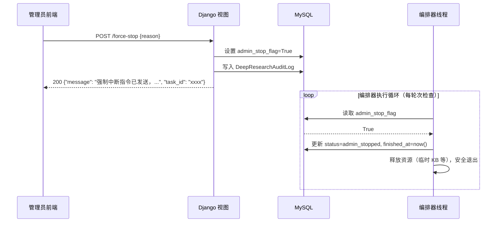

# 管理端——访问频次控制 & Deep Research 任务实时监控

## 后端概要设计文档

> **功能归属**：管理端（Admin Side）  
> **开发周期**：第一迭代周  
> **规格依据**：《学术文献科研助手》需求规格说明书 FR-SJGL-0006 ~ FR-SJGL-0009、FR-YHJH-0010  
> **参考文档**：`[ARCHITECTURE.md](./ARCHITECTURE.md)`、`[Deep-Research-概要设计.md](./Deep-Research-概要设计.md)`

---

## 目录

1. [设计目标与范围](#1-设计目标与范围)
2. [功能一：访问频次控制](#2-功能一访问频次控制)
  - [2.1 业务逻辑概述](#21-业务逻辑概述)
  - [2.2 新增数据模型](#22-新增数据模型)
  - [2.3 接口定义](#23-接口定义)
  - [2.4 核心流程](#24-核心流程)
3. [功能二：Deep Research 任务实时监控](#3-功能二deep-research-任务实时监控)
  - [3.1 业务逻辑概述](#31-业务逻辑概述)
  - [3.2 新增数据模型](#32-新增数据模型)
  - [3.3 接口定义](#33-接口定义)
  - [3.4 核心流程](#34-核心流程)
4. [落地规划](#4-落地规划)
  - [4.1 新增文件清单](#41-新增文件清单)
  - [4.2 路由注册](#42-路由注册)
  - [4.3 子任务拆分](#43-子任务拆分)

---

## 1. 设计目标与范围

### 1.1 目标


| 功能            | 目标描述                                                                                  |
| ------------- | ------------------------------------------------------------------------------------- |
| **访问频次控制**    | 管理员可配置各功能（Deep Research、AI 对话等高成本功能）的用户访问频次上限，查看实时访问统计，并对特定用户进行配额调整或封禁；同时在用户侧执行限频拦截逻辑 |
| **DR 任务实时监控** | 管理员可实时查看所有用户的 Deep Research 任务运行态（状态、进度、Token 消耗），查看执行轨迹，并执行强制中断、屏蔽输出等干预操作，所有操作留有审计日志 |


### 1.2 与现有系统的关系

```
business/api/manage.py          ← 现有管理端 API，本次在此基础上扩展
business/models/statistic.py    ← 现有统计模型，访问频次模型与之并列新增
business/api/deep_research.py   ← 待新增，Deep Research 主模块（DR 监控 API 在此文件内）
business/models/deep_research*  ← 待新增，DR 任务模型（由 Deep Research 主模块定义）
```

两个功能**共享** `@authenticate_admin` 鉴权装饰器（`business/utils/authenticate.py`），响应格式统一使用 `ok` / `fail`（`business/utils/response.py`）。

---

## 2. 功能一：访问频次控制

### 2.1 业务逻辑概述

访问频次控制分为两层：

**配置层（管理员操作）**

- 全局规则：针对某一功能类型设定每日/每周/每月上限，对所有用户生效
- 用户级覆盖：为特定用户单独设定更高或更低的配额（覆盖全局规则）
- 规则可启用/禁用，禁用后对应功能不再限制

**执行层（用户请求时自动触发）**

- 用户调用受限接口时（如发起 Deep Research 任务），频次中间件检查当前周期内已用次数
- 超限返回业务错误码；未超限则放行并写入访问日志
- 管理员可查看任意用户的实时访问频次与历史统计

### 2.2 新增数据模型

#### 2.2.1 `AccessFrequencyRule`（访问频次规则表）

> 文件路径：`business/models/access_frequency.py`

```python
class AccessFrequencyRule(models.Model):
    """
    全局访问频次规则。
    定义某一功能类型在指定时间窗口内允许的最大访问次数。
    """

    FEATURE_CHOICES = [
        ("deep_research", "Deep Research 任务"),
        ("ai_chat",       "AI 对话（研读/调研助手）"),
        ("summary",       "综述报告生成"),
        ("export",        "报告批量导出"),
    ]

    WINDOW_CHOICES = [
        ("daily",   "每日"),
        ("weekly",  "每周"),
        ("monthly", "每月"),
    ]

    rule_id     = models.AutoField(primary_key=True)
    feature     = models.CharField(max_length=32, choices=FEATURE_CHOICES, unique=True)
    window      = models.CharField(max_length=16, choices=WINDOW_CHOICES, default="daily")
    max_count   = models.IntegerField(default=10)  # -1 表示不限制
    is_enabled  = models.BooleanField(default=True)
    description = models.CharField(max_length=255, blank=True, default="")
    updated_at  = models.DateTimeField(auto_now=True)
    updated_by  = models.CharField(max_length=64, blank=True, default="")  # 记录操作管理员
```

**数据库表名**：`access_frequency_rule`（通过 `Meta.db_table` 自定义，下同）

---

#### 2.2.2 `UserAccessQuotaOverride`（用户配额覆盖表）

```python
class UserAccessQuotaOverride(models.Model):
    """
    针对单个用户的配额覆盖。
    若存在此记录，则忽略全局规则，使用本记录中的 max_count。
    max_count = -1 表示该用户不受限制（VIP / 管理员特殊授权）。
    max_count = 0  表示该用户被完全封禁此功能。
    """

    user        = models.ForeignKey("User", on_delete=models.CASCADE,
                                    related_name="quota_overrides")
    feature     = models.CharField(max_length=32)
    max_count   = models.IntegerField(default=-1)
    reason      = models.CharField(max_length=255, blank=True, default="")
    created_at  = models.DateTimeField(auto_now_add=True)
    updated_at  = models.DateTimeField(auto_now=True)
    updated_by  = models.CharField(max_length=64, blank=True, default="")

    class Meta:
        unique_together = ("user", "feature")
```

---

#### 2.2.3 `FeatureAccessLog`（功能访问日志表）

```python
class FeatureAccessLog(models.Model):
    """
    记录用户每次调用受限功能的日志，用于频次统计与审计。
    采用轻量写入（不阻塞主请求），由视图层在放行后异步写入（threading）。
    """

    STATUS_CHOICES = [
        ("allowed",  "放行"),
        ("rejected", "因超限被拒"),
    ]

    user        = models.ForeignKey("User", on_delete=models.SET_NULL,
                                    null=True, related_name="access_logs")
    feature     = models.CharField(max_length=32, db_index=True)
    ip_address  = models.GenericIPAddressField(null=True, blank=True)
    status      = models.CharField(max_length=16, choices=STATUS_CHOICES)
    accessed_at = models.DateTimeField(auto_now_add=True, db_index=True)
    extra       = models.JSONField(default=dict, blank=True)
    # extra 可存放 task_id、search_record_id 等关联信息，便于跨表追溯
```

> **性能考量**：日志写入在放行后由后台线程完成，不影响接口响应延迟。管理端统计查询时对 `(feature, accessed_at)` 复合索引进行聚合，避免全表扫描。

---

### 2.3 接口定义

所有接口均位于 `business/api/manage_access_frequency.py`，路由前缀 `/api/manage/access-frequency`，需 `@authenticate_admin`。

#### 规则管理


| 方法     | 路径                                             | 说明             |
| ------ | ---------------------------------------------- | -------------- |
| GET    | `/api/manage/access-frequency/rules`           | 获取全部频次规则列表     |
| POST   | `/api/manage/access-frequency/rules`           | 新增规则           |
| PUT    | `/api/manage/access-frequency/rules/<rule_id>` | 修改规则（上限、窗口、启停） |
| DELETE | `/api/manage/access-frequency/rules/<rule_id>` | 删除规则           |


**GET `/rules` 响应示例：**

```json
{
  "rules": [
    {
      "rule_id": 1,
      "feature": "deep_research",
      "feature_label": "Deep Research 任务",
      "window": "daily",
      "window_label": "每日",
      "max_count": 5,
      "is_enabled": true,
      "description": "每日限 5 次 DR 任务",
      "updated_at": "2026-04-18T10:00:00",
      "updated_by": "admin"
    }
  ]
}
```

**POST `/rules` 响应示例（新增成功）：**

```json
{
  "rule": {
    "rule_id": 1,
    "feature": "deep_research",
    "feature_label": "Deep Research 任务",
    "window": "daily",
    "window_label": "每日",
    "max_count": 5,
    "is_enabled": true,
    "description": "每日限 5 次 DR 任务",
    "updated_at": "2026-04-18T10:00:00",
    "updated_by": "admin"
  }
}
```

**POST `/rules` 请求体：**

```json
{
  "feature": "deep_research",
  "window": "daily",
  "max_count": 5,
  "is_enabled": true,
  "description": "每日限 5 次 DR 任务"
}
```

---

#### 用户配额覆盖管理


| 方法     | 路径                                                          | 说明                                    |
| ------ | ----------------------------------------------------------- | ------------------------------------- |
| GET    | `/api/manage/access-frequency/user-overrides`               | 查看所有用户覆盖配置（支持 `user_id`、`feature` 筛选） |
| POST   | `/api/manage/access-frequency/user-overrides`               | 新增/更新特定用户的配额覆盖                        |
| DELETE | `/api/manage/access-frequency/user-overrides/<override_id>` | 删除覆盖（恢复全局规则）                          |


**POST `/user-overrides` 请求体：**

```json
{
  "user_id": "xxxx-xxxx-xxxx",
  "feature": "deep_research",
  "max_count": 20,
  "reason": "核心科研用户，特批提额"
}
```

---

#### 访问频次统计查询


| 方法  | 路径                                                   | 说明                                              |
| --- | ---------------------------------------------------- | ----------------------------------------------- |
| GET | `/api/manage/access-frequency/stats`                 | 全局统计：各功能今日/本周被拒次数、总调用次数                         |
| GET | `/api/manage/access-frequency/stats/users`           | 用户维度排行：访问最频繁的 Top-N 用户（支持按 `feature`、`date` 筛选） |
| GET | `/api/manage/access-frequency/stats/users/<user_id>` | 特定用户的访问频次详情（含本周期已用次数、剩余次数）                      |


**GET `/stats` 响应示例：**

```json
{
  "today": {
    "deep_research": { "total": 42, "allowed": 38, "rejected": 4 },
    "ai_chat":       { "total": 210, "allowed": 210, "rejected": 0 },
    "summary":       { "total": 30,  "allowed": 30,  "rejected": 0 },
    "export":        { "total": 8,   "allowed": 8,   "rejected": 0 }
  },
  "active_rules": 3,
  "override_count": 5
}
```

> `today` 包含所有 `FEATURE_CHOICES` 功能的当日统计；`override_count` 为当前生效的用户级配额覆盖总数。

**GET `/stats/users` 响应示例（Top-N 排行）：**

```json
{
  "items": [
    { "user_id": "xxxx-...", "username": "zhangsan", "feature": "deep_research", "count": 5 },
    { "user_id": "yyyy-...", "username": "lisi",     "feature": "deep_research", "count": 3 }
  ]
}
```

**GET `/stats/users/<user_id>` 响应示例：**

```json
{
  "user_id": "xxxx-xxxx-xxxx",
  "username": "zhangsan",
  "features": [
    {
      "feature": "deep_research",
      "window": "daily",
      "limit": 5,
      "used": 3,
      "remaining": 2,
      "override_applied": false
    },
    {
      "feature": "ai_chat",
      "window": "daily",
      "limit": -1,
      "used": 12,
      "remaining": null,
      "override_applied": false
    }
  ]
}
```

> `limit = -1` 表示该功能不受限制，此时 `remaining` 为 `null`。

---

### 2.4 核心流程

#### 2.4.1 用户侧限频拦截（在用户端接口中复用）

频次检查逻辑封装为工具函数 `business/utils/rate_limit.py`，在用户调用高成本接口（如 `POST /api/deep-research/tasks`）时被调用：

```
用户发起请求
    ↓
check_rate_limit(user, feature)
    ├── 查询 UserAccessQuotaOverride（用户级覆盖）
    │       存在 → 使用覆盖配额
    │       不存在 → 查询 AccessFrequencyRule（全局规则）
    ├── 规则未启用 / max_count == -1 → 直接放行
    ├── 统计 FeatureAccessLog 中当前窗口内 status="allowed" 的记录数
    │       已用次数 < max_count → 放行，后台线程写入 FeatureAccessLog(status="allowed")
    │       已用次数 >= max_count → 拒绝，写入 FeatureAccessLog(status="rejected")
    │                               返回 fail({"code": "RATE_LIMIT_EXCEEDED", ...})
    └── 返回结果给视图层
```

#### 2.4.2 管理端规则变更流程

```
管理员修改规则
    ↓
PUT /api/manage/access-frequency/rules/<rule_id>
    ↓
更新 AccessFrequencyRule（updated_by 写入管理员用户名）
    ↓
返回最新规则（无需重启服务，下次请求实时生效）
```

---

## 3. 功能二：Deep Research 任务实时监控

### 3.1 业务逻辑概述

管理员对所有用户的 Deep Research 任务具有**全局可见性**与**有限干预权**：

- **列表监控**：可按状态、用户、时间范围筛选所有任务，实时查看运行中任务数量、资源占用（Token 消耗）等聚合指标
- **轨迹查看**：查看指定任务的逐步执行轨迹（每个 Step 的阶段、摘要、时间戳）
- **强制中断**：对运行中/排队中的任务下达中断指令，编排器检测到中断标志后安全退出，任务状态置为 `admin_stopped`
- **屏蔽输出**：将已完成任务的报告标记为 `suppressed`，用户端无法访问该报告，适用于内容合规场景
- **审计日志**：所有管理干预操作自动写入 `DeepResearchAuditLog`，记录操作人、操作类型、操作时间及原因

### 3.2 新增数据模型

> 以下模型是 Deep Research 主链路的核心模型，同时服务于用户端与管理端。本节从管理端视角说明各字段的监控用途。

#### 3.2.1 `DeepResearchTask`（Deep Research 任务主表）

> 文件路径：`business/models/deep_research_task.py`

```python
class DeepResearchTask(models.Model):
    """
    Deep Research 任务主记录。
    编排器运行时持续更新 current_phase / progress / step_summary / token_used_total。
    管理端通过 status / admin_stop_flag / output_suppressed 实施干预。
    """

    STATUS_CHOICES = [
        ("pending",          "待处理"),
        ("queued",           "排队中"),
        ("running",          "执行中"),
        ("completed",        "已完成"),
        ("failed",           "失败"),
        ("aborted",          "用户主动中止"),
        ("admin_stopped",    "管理员强制中断"),
        ("violation_pending","合规审核中"),
        ("needs_review",     "待人工审核"),
        ("archived",         "已归档"),
    ]

    PHASE_CHOICES = [
        ("planning",    "规划"),
        ("searching",   "检索"),
        ("reading",     "阅读"),
        ("reflecting",  "反思"),
        ("writing",     "生成报告"),
    ]

    task_id         = models.UUIDField(primary_key=True, default=uuid.uuid4, editable=False)
    user            = models.ForeignKey("User", on_delete=models.CASCADE,
                                        related_name="dr_tasks")
    file_reading    = models.ForeignKey("FileReading", on_delete=models.SET_NULL,
                                        null=True, blank=True, related_name="dr_tasks")

    # 任务配置
    query           = models.TextField()               # 用户原始研究问题
    max_rounds      = models.IntegerField(default=3)   # 最大迭代轮数

    # 运行态（编排器实时更新）
    status          = models.CharField(max_length=24, choices=STATUS_CHOICES,
                                       default="pending", db_index=True)
    current_phase   = models.CharField(max_length=16, choices=PHASE_CHOICES,
                                       null=True, blank=True)
    progress        = models.IntegerField(default=0)   # 0-100 进度百分比
    step_summary    = models.CharField(max_length=512, blank=True, default="")  # 最新步骤摘要
    token_used_total= models.IntegerField(default=0)   # 累计消耗 Token 数
    error_message   = models.TextField(blank=True, default="")

    # 结果
    report          = models.JSONField(null=True, blank=True)  # 结构化报告 JSON
    citation_coverage = models.FloatField(null=True, blank=True)  # 循证覆盖率

    # 管理端控制字段
    admin_stop_flag     = models.BooleanField(default=False)
    # 编排器每轮检查此标志，为 True 时安全退出并将 status 改为 admin_stopped
    output_suppressed   = models.BooleanField(default=False)
    # 为 True 时用户端 GET report 接口返回 403，报告仍保存在数据库中

    # 时间戳
    created_at      = models.DateTimeField(auto_now_add=True, db_index=True)
    started_at      = models.DateTimeField(null=True, blank=True)
    finished_at     = models.DateTimeField(null=True, blank=True)
```

**关键字段说明（管理端视角）：**


| 字段                           | 管理端用途             |
| ---------------------------- | ----------------- |
| `status`                     | 列表筛选、统计运行中任务数     |
| `token_used_total`           | 监控资源消耗，识别异常高消耗任务  |
| `admin_stop_flag`            | 强制中断的信号量，编排器轮询此字段 |
| `output_suppressed`          | 内容合规屏蔽开关          |
| `created_at` / `finished_at` | 时间范围筛选、任务时长计算     |


---

#### 3.2.2 `DeepResearchStep`（执行轨迹步骤表）

> 文件路径：`business/models/deep_research_task.py`（与主表同文件）

```python
class DeepResearchStep(models.Model):
    """
    Deep Research 任务的单个执行步骤，构成可追溯的执行轨迹。
    编排器每完成一个阶段动作即写入一条记录。
    """

    task        = models.ForeignKey(DeepResearchTask, on_delete=models.CASCADE,
                                    related_name="steps")
    seq         = models.IntegerField()               # 步骤序号（从 1 开始）
    phase       = models.CharField(max_length=16)     # 所属阶段
    action      = models.CharField(max_length=64)     # 动作描述（如"检索 arXiv"、"调用 LLM 反思"）
    summary     = models.TextField(blank=True)         # 步骤摘要（可含截断的 LLM 输出）
    token_used  = models.IntegerField(default=0)      # 本步骤消耗 Token
    created_at  = models.DateTimeField(auto_now_add=True)

    class Meta:
        ordering = ["seq"]
        unique_together = ("task", "seq")
```

---

#### 3.2.3 `DeepResearchAuditLog`（管理操作审计日志表）

> 文件路径：`business/models/deep_research_task.py`

```python
class DeepResearchAuditLog(models.Model):
    """
    记录管理员对 Deep Research 任务的所有干预操作。
    不可删除，仅供审计。
    """

    ACTION_CHOICES = [
        ("force_stop",       "强制中断"),
        ("suppress_output",  "屏蔽输出"),
        ("unsuppress_output","恢复输出"),
        ("view_trace",       "查看轨迹"),  # 可选，审计敏感任务的查看行为
    ]

    log_id      = models.AutoField(primary_key=True)
    task        = models.ForeignKey(DeepResearchTask, on_delete=models.CASCADE,
                                    related_name="audit_logs")
    admin       = models.ForeignKey("Admin", on_delete=models.SET_NULL,
                                    null=True, related_name="dr_audit_logs")
    action      = models.CharField(max_length=32, choices=ACTION_CHOICES)
    reason      = models.CharField(max_length=512, blank=True, default="")
    created_at  = models.DateTimeField(auto_now_add=True)
    extra       = models.JSONField(default=dict, blank=True)
    # extra 可存放操作前的 status snapshot 等快照信息
```

---

### 3.3 接口定义

所有接口均位于 `business/api/deep_research.py`，管理端路由前缀 `/api/manage/deep-research`，需 `@authenticate_admin`。

#### 任务列表与统计


| 方法  | 路径                                | 说明           |
| --- | --------------------------------- | ------------ |
| GET | `/api/manage/deep-research/tasks` | 分页列表，支持多条件筛选 |
| GET | `/api/manage/deep-research/stats` | 整体统计摘要       |


**GET `/tasks` 查询参数：**


| 参数          | 类型     | 说明               |
| ----------- | ------ | ---------------- |
| `status`    | string | 任务状态筛选（可多值，逗号分隔） |
| `user_id`   | string | 指定用户             |
| `date_from` | string | 创建时间起始（ISO 8601） |
| `date_to`   | string | 创建时间截止           |
| `page_num`  | int    | 页码，默认 1          |
| `page_size` | int    | 每页数量，默认 20       |


**GET `/tasks` 响应示例：**

```json
{
  "total": 158,
  "page_num": 1,
  "page_size": 20,
  "items": [
    {
      "task_id": "xxxxxxxx-xxxx-xxxx-xxxx-xxxxxxxxxxxx",
      "user_id": "yyyyyyyy-xxxx-xxxx-xxxx-xxxxxxxxxxxx",
      "username": "zhangsan",
      "query": "Transformer 在医学图像中的应用综述",
      "status": "running",
      "current_phase": "searching",
      "progress": 35,
      "step_summary": "正在检索 arXiv...",
      "token_used_total": 12400,
      "output_suppressed": false,
      "created_at": "2026-04-18T09:32:00+00:00",
      "started_at": "2026-04-18T09:32:05+00:00",
      "finished_at": null
    }
  ]
}
```

**GET `/stats` 响应示例：**

```json
{
  "running_count": 3,
  "queued_count": 1,
  "today_total": 47,
  "today_completed": 41,
  "today_failed": 2,
  "today_aborted": 2,
  "today_admin_stopped": 1,
  "today_token_total": 1284000,
  "suppressed_count": 5
}
```

> `today_aborted` 统计今日用户主动中止的任务数（与 `today_admin_stopped` 分开计数）。

---

#### 任务详情与执行轨迹


| 方法  | 路径                                                | 说明             |
| --- | ------------------------------------------------- | -------------- |
| GET | `/api/manage/deep-research/tasks/<task_id>`       | 任务完整详情（含报告元信息） |
| GET | `/api/manage/deep-research/tasks/<task_id>/trace` | 执行轨迹（步骤列表）     |


**GET `/tasks/<task_id>/trace` 响应示例：**

```json
{
  "task_id": "xxxxxxxx-xxxx-xxxx-xxxx-xxxxxxxxxxxx",
  "status": "running",
  "steps": [
    {
      "seq": 1,
      "phase": "planning",
      "action": "LLM 分解子问题",
      "summary": "将研究问题拆分为 4 个子问题：...",
      "token_used": 860,
      "created_at": "2026-04-18T09:32:06+00:00"
    },
    {
      "seq": 2,
      "phase": "searching",
      "action": "检索 arXiv",
      "summary": "查询关键词 'Transformer medical imaging'，获得 15 篇候选论文",
      "token_used": 0,
      "created_at": "2026-04-18T09:32:12+00:00"
    }
  ]
}
```

> 调用此接口会自动写入一条 `view_trace` 类型的 `DeepResearchAuditLog`，供合规审计留存。

---

#### 管理干预操作


| 方法   | 路径                                                            | 说明         |
| ---- | ------------------------------------------------------------- | ---------- |
| POST | `/api/manage/deep-research/tasks/<task_id>/force-stop`        | 强制中断任务     |
| POST | `/api/manage/deep-research/tasks/<task_id>/suppress-output`   | 屏蔽任务报告输出   |
| POST | `/api/manage/deep-research/tasks/<task_id>/unsuppress-output` | 恢复任务报告输出   |
| GET  | `/api/manage/deep-research/tasks/<task_id>/audit-logs`        | 查看该任务的审计日志 |


**POST `/force-stop` 请求体：**

```json
{
  "reason": "任务资源消耗异常，超过 50k Token 仍未完成"
}
```

**POST `/force-stop` 处理逻辑：**

1. 校验任务存在且状态为 `running` 或 `queued`
2. 将 `admin_stop_flag` 置为 `True`（编排器下一轮检查时感知并安全退出）
3. 写入 `DeepResearchAuditLog`（action=`force_stop`）
4. 立即返回成功；任务状态由编排器异步更新为 `admin_stopped`

**POST `/force-stop` 成功响应：**

```json
{
  "message": "强制中断指令已发送，任务将在下一个执行间隙安全停止",
  "task_id": "xxxxxxxx-xxxx-xxxx-xxxx-xxxxxxxxxxxx"
}
```

**POST `/suppress-output` 请求体：**

```json
{
  "reason": "报告内容涉及不当信息，临时屏蔽待人工复核"
}
```

**POST `/suppress-output` / `/unsuppress-output` 成功响应：**

```json
{ "message": "报告已屏蔽，用户端将无法获取该报告内容" }
```

```json
{ "message": "报告屏蔽已解除，用户端可正常访问" }
```

**GET `/tasks/<task_id>/audit-logs` 响应示例：**

```json
{
  "logs": [
    {
      "log_id": 3,
      "task_id": "xxxxxxxx-xxxx-xxxx-xxxx-xxxxxxxxxxxx",
      "admin_id": "zzzzzzzz-xxxx-xxxx-xxxx-xxxxxxxxxxxx",
      "admin_name": "admin",
      "action": "force_stop",
      "action_label": "强制中断",
      "reason": "任务资源消耗异常",
      "created_at": "2026-04-18T10:05:00+00:00",
      "extra": { "task_status_at_action": "running" }
    }
  ]
}
```

---

#### 审计日志查询


| 方法  | 路径                                     | 说明                                |
| --- | -------------------------------------- | --------------------------------- |
| GET | `/api/manage/deep-research/audit-logs` | 全局审计日志列表（支持按 admin、action、时间范围筛选） |


---

### 3.4 核心流程

#### 3.4.1 强制中断流程




#### 3.4.2 任务监控轮询流程（管理端前端）

管理端前端可对"运行中任务"列表进行定时轮询（建议间隔 5s），通过 `GET /stats` 获取聚合数，通过 `GET /tasks?status=running` 获取实时列表：

```
管理端定时轮询
    ↓
GET /api/manage/deep-research/stats
    → 获取 running_count、今日 Token 消耗等摘要数据
    ↓
GET /api/manage/deep-research/tasks?status=running
    → 获取运行中任务列表（progress、step_summary 实时刷新）
    ↓
发现异常任务 → POST .../force-stop 干预
```

---

## 4. 落地规划

### 4.1 新增文件清单


| 类型  | 文件路径                                      | 说明                          |
| --- | ----------------------------------------- | --------------------------- |
| 模型  | `business/models/access_frequency.py`     | 三个频次控制模型                    |
| 模型  | `business/models/deep_research_task.py`   | DR 任务主表、步骤表、审计日志表           |
| API | `business/api/manage_access_frequency.py` | 频次控制管理端接口                   |
| API | `business/api/deep_research.py`           | DR 用户端 + 管理端接口（合并一文件）       |
| 工具  | `business/utils/rate_limit.py`            | 频次检查工具函数 `check_rate_limit` |
| 迁移  | `business/migrations/00xx_...py`          | 自动生成，`makemigrations` 后产出   |


### 4.2 路由注册

需在 `backend/urls.py` 新增以下路由（追加至 manage 路由组后）：

```python
# ── 访问频次控制 ──────────────────────────────────────────────
path("api/manage/access-frequency/rules",
     manage_access_frequency.rule_list_create),
path("api/manage/access-frequency/rules/<int:rule_id>",
     manage_access_frequency.rule_update_delete),
path("api/manage/access-frequency/user-overrides",
     manage_access_frequency.override_list_create),
path("api/manage/access-frequency/user-overrides/<int:override_id>",
     manage_access_frequency.override_delete),
path("api/manage/access-frequency/stats",
     manage_access_frequency.global_stats),
path("api/manage/access-frequency/stats/users",
     manage_access_frequency.user_stats_ranking),
path("api/manage/access-frequency/stats/users/<str:user_id>",
     manage_access_frequency.user_stats_detail),

# ── Deep Research 管理端监控 ─────────────────────────────────
path("api/manage/deep-research/tasks",
     deep_research.admin_task_list),
path("api/manage/deep-research/tasks/<str:task_id>",
     deep_research.admin_task_detail),
path("api/manage/deep-research/tasks/<str:task_id>/trace",
     deep_research.admin_task_trace),
path("api/manage/deep-research/tasks/<str:task_id>/force-stop",
     deep_research.admin_force_stop),
path("api/manage/deep-research/tasks/<str:task_id>/suppress-output",
     deep_research.admin_suppress_output),
path("api/manage/deep-research/tasks/<str:task_id>/unsuppress-output",
     deep_research.admin_unsuppress_output),
path("api/manage/deep-research/tasks/<str:task_id>/audit-logs",
     deep_research.admin_task_audit_logs),
path("api/manage/deep-research/stats",
     deep_research.admin_stats),
path("api/manage/deep-research/audit-logs",
     deep_research.admin_global_audit_logs),
```

### 4.3 子任务拆分


| 子任务    | 内容                                                                           | 依赖               |
| ------ | ---------------------------------------------------------------------------- | ---------------- |
| **A1** | 定义并迁移 `AccessFrequencyRule`、`UserAccessQuotaOverride`、`FeatureAccessLog` 三张表 | 无                |
| **A2** | 实现 `utils/rate_limit.py` 中的 `check_rate_limit` 函数                            | A1               |
| **A3** | 实现 `manage_access_frequency.py` 所有管理端接口 + 路由注册                               | A1               |
| **A4** | 在 DR 创建入口（用户侧）接入 `check_rate_limit` 调用                                       | A2，DR 主模块 M1 完成后 |
| **D1** | 定义并迁移 `DeepResearchTask`、`DeepResearchStep`、`DeepResearchAuditLog` 三张表       | 无（可与 A1 同步）      |
| **D2** | 实现 DR 管理端只读接口（列表、详情、轨迹、统计）                                                   | D1               |
| **D3** | 实现干预接口（force-stop、suppress/unsuppress）及审计日志写入                                | D1、D2            |
| **D4** | 编排器集成 `admin_stop_flag` 检查逻辑（与 DR 主链路 M2 联调）                                 | D1，DR 编排器        |


> A1、D1 可并行推进；A2、A3 在 A1 后推进；D2、D3 在 D1 后推进。

---

*文档版本：v0.1 | 编写日期：2026-04-18*