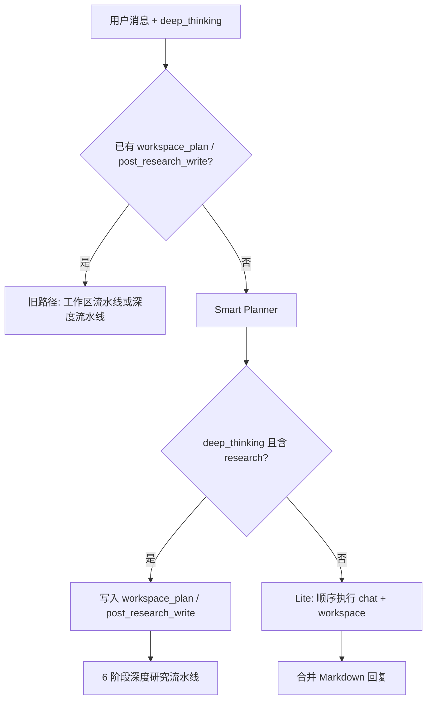

# 科研助手智能编排器升级说明

## 1. 背景

此前编排器大致通过「工作区意图路由」将用户请求归入三类：**纯工作区**、**研究后写入工作区**、**纯深度研究**。简单对话仍会进入完整 6 阶段流水线，首包时间与 token 成本高。

本次升级引入 **统一任务拆解（Smart Planner）** 与 **轻量执行器（Lite Orchestrator）**，并增加前端可配的 **「深度思考」开关**（对应请求体字段 `deep_thinking`，默认 `false`）。

## 2. 核心行为

### 2.1 请求体

创建任务或会话消息时，与原有字段并存：

| 字段 | 类型 | 默认 | 说明 |
|------|------|------|------|
| `deep_thinking` | `bool` | `false` | 为 `true` 时，规划器可产出 `research` 步骤，并走完整深度研究流水线；为 `false` 时禁止 `research`，调研类诉求在规划阶段降级为 `chat`，整体走轻量流水线。 |

前端 `ResearchAgentSession.vue` 中「深度思考」复选框会传入该字段。

### 2.2 Smart Planner（`research_agent/smart_planner.py`）

对用户整段输入调用一次结构化 LLM，输出合法 JSON，字段包括：

- `summary`：对需求的简短概括；
- `needs_deep_research`：是否包含需深入调研的意图（与 `deep_thinking` 共同作用）；
- `steps`：有序步骤数组（最多 8 步），每步 `type` 为以下之一：
  - **`chat`**：`title` + `prompt`，由轻量对话 LLM 直接回复，不调用文件工具；
  - **`workspace`**：`title` + `action` + `args`（及可选 `content_brief`），与既有工作区工具一致；
  - **`research`**：仅当 `deep_thinking=true` 时允许；`title` + `goal`，可选 `post_write_path`。

规划失败时回退为单步 `fallback_chat_plan`（等价于「把整个请求当一条 chat 指令」）。

提示词：`research_agent/prompts.py` 中的 `SMART_PLANNER_SYSTEM_PROMPT` / `SMART_PLANNER_USER_PROMPT`。

### 2.3 编排分流（`research_agent/orchestrator.py` → `execute_task_pipeline`）

1. **显式兼容旧 API**：若 `runtime_config` 中已带有 `workspace_plan` 或 `post_research_write`（不经 Smart Planner），仍按原逻辑处理（含专用工作区流水线）。
2. **否则**调用 `detect_smart_plan(query, allow_research=deep_thinking)`。
3. **`deep_thinking=true` 且步骤中存在 `research`**  
   - 将规划中所有 `workspace` 步骤写入 `runtime_config.workspace_plan`；  
   - 若某 `research` 步带 `post_write_path`，写入 `post_research_write`；  
   - 继续执行本文件内原有 **6 阶段深度研究流水线**（plan → decide → search → read → reflect → write），子任务循环中会照常执行工作区步骤。
4. **否则**（默认轻量）  
   - 将完整 `smart_plan` 与 `lite_pipeline=true` 写入 `runtime_config`；  
   - 调用 **`execute_lite_pipeline`** 后直接返回，不再进入 6 阶段主循环。

### 2.4 Lite Orchestrator（`research_agent/lite_orchestrator.py`）

按 `smart_plan.steps` 顺序执行：

- **`chat`**：流式、关闭 thinking 的一次 `chat_completion`，结果累积到最终回复 Markdown。
- **`workspace`**：与旧逻辑一致，调用 `route_tool_call(workspace, …)`；支持 `content_brief` 物化为正文再写入；高风险/冲突仍进入 `pending_action`。审批通过后由 `mark_smart_workspace_step_approved` 合并 `args` 与 `approved_smart_workspace_steps`（见 `views.py` 与 `post_intervention`）。
- **意外出现的 `research`**：在轻量模式下视为降级为 `chat`（保险分支）。

任务结束：写入 `result_payload.body`（Markdown），若有工作区操作则助手消息仍带 `[[RA_REPORT]]` 前缀以便前端渲染报告块；`pipeline` 元数据为 `["plan", "lite", "write"]`。

### 2.5 与旧 `workspace_intent.py` 的关系

`workspace_intent.detect_workspace_plan` 不再作为统一入口；Smart Planner 覆盖「混合对话 + 文件 +（可选）研究」的拆解。若客户端直接传入 `workspace_plan`，行为与升级前一致，无需改客户端。

## 3. 相关文件一览

| 文件 | 作用 |
|------|------|
| `research_agent/smart_planner.py` | LLM 结构化规划与校验 |
| `research_agent/lite_orchestrator.py` | 轻量逐步执行、汇总输出 |
| `research_agent/orchestrator.py` | 分流 + 深度流水线 + 工作区专用流水线 |
| `research_agent/prompts.py` | Smart Planner 与 Lite Chat 提示词 |
| `research_agent/views.py` | `deep_thinking` 校验与 lite 工作区审批落地 |
| `EPP-Frontend-Dev/.../ResearchAgentSession.vue` | 「深度思考」开关与请求透传 |

## 4. 流程示意（Mermaid）

## 5. 运维与排错

- 规划阶段日志前缀：`[research_agent][smart_planner]`。  
- 轻量执行日志前缀：`[research_agent][lite]`。  
- 若供应商返回非 JSON 或 schema 校验失败，会自动 fallback 单步 chat，并在 `plan` 步骤中注明「回退为单步 chat」。

## 6. 单元测试

项目组选择暂不新增针对本模块的自动化用例；发布前建议至少手动验证：

1. `deep_thinking` 关闭：纯对话、纯工作区、混合「先解释再写文件」；
2. `deep_thinking` 开启：含「调研 + 写入 report.md」类请求；
3. 工作区高风险操作触发 `pending_action` 后 approve 能继续后续步骤。
