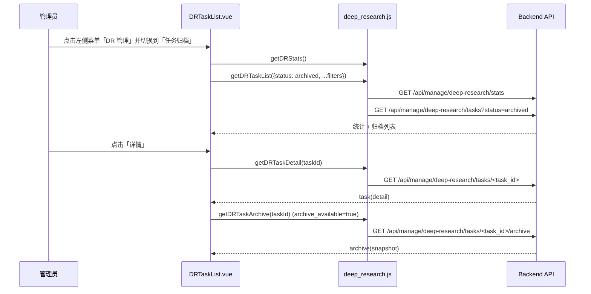

# 管理端前端设计文档
## Deep Research 任务归档（FR-SJGL-0009）

> **项目**：EPP-Frontend-Manager-Dev（学术科研助手管理端）  
> **功能归属**：管理端新增模块（DR 数据管理子功能）  
> **开发周期**：第一迭代周  
> **依据文档**：`tasks/3.6.9深度研究任务归档.md`、`管理端前端设计文档-访问频次控制与DR监控.md`  
> **文档版本**：v0.4 | 更新日期：2026-04-27（同步代码修正）

---

## 目录

1. [现有项目结构概览](#1-现有项目结构概览)
2. [总体修改规划](#2-总体修改规划)
3. [功能：Deep Research 任务归档](#3-功能deep-research-任务归档)
   - [3.1 页面层级结构](#31-页面层级结构)
   - [3.2 路由设计](#32-路由设计)
   - [3.3 API 模块设计](#33-api-模块设计)
   - [3.4 视图组件设计](#34-视图组件设计)
4. [侧边栏修改](#4-侧边栏修改)
5. [新增文件清单](#5-新增文件清单)
6. [现有文件修改清单](#6-现有文件修改清单)
7. [开发子任务拆分](#7-开发子任务拆分)
8. [附录：归档字段与展示约定](#8-附录归档字段与展示约定)
9. [后续需要完善的代码工作](#9-后续需要完善的代码工作)

---

## 1. 现有项目结构概览

```text
EPP-Frontend-Manager-Dev/
├── src/
│   ├── api/
│   │   ├── deep_research.js           # DR 相关 API（列表、详情、轨迹、审计、归档详情）
│   │   └── ...
│   ├── router/
│   │   └── index.js                   # 路由表 + 守卫
│   ├── views/
│   │   ├── layout/
│   │   │   └── LayoutContainer.vue    # 左侧菜单（DR 管理统一入口）
│   │   └── deep_research/
│   │       ├── DRMonitorManage.vue    # DR 模块统一容器（子菜单）
│   │       ├── DRTaskList.vue         # DR 任务列表（本次复用为归档列表页）
│   │       ├── DRTaskDetailDrawer.vue # DR 任务详情抽屉（含归档信息展示）
│   │       ├── DRTraceDrawer.vue      # 执行轨迹抽屉
│   │       └── ...
│   └── utils/request.js               # Axios 封装
```

**技术栈**：Vue 3（Options API）、Vue Router 4、Vuex 4、Element Plus、Axios、Sass

**本功能设计原则**：
- 以最小改动复用既有 DR 任务列表页，避免重复实现“归档列表”页面。
- 路由层通过 props 固定筛选状态为 `archived`，并整合进 DR 统一管理模块。
- 详情抽屉补充归档信息区，展示“归档前终态、归档时间、引用溯源条目、资源审计报告”。

---

## 2. 总体修改规划

### 2.1 当前落地内容汇总（截至 2026-04-27）

| 类型 | 规划 | 当前代码状态 |
|------|------|------|
| 菜单调整 | 归档入口并入 `DR 管理` 模块顶部子菜单 | 已完成 |
| 路由调整 | 新增 `/deep-research/archive`；保留 `/deep-research-archive` 兼容跳转 | 已完成 |
| 新增 API 函数 | `getDRTaskArchive(taskId)` | 已完成 |
| 复用视图 | 复用 `DRTaskList.vue` 作为归档任务页 | 已完成 |
| 增强组件 | `DRTaskDetailDrawer.vue` 新增归档信息展示区 | 已完成 |
| 详情空态修复 | 非归档任务不再误显示“无法加载任务详情” | 已完成 |
| 状态/阶段映射统一 | 列表、详情、轨迹共用同一套常量 | 已完成 |
| 归档详情降级展示 | 归档接口失败时回退 `archive_summary` 基础字段 | 已完成 |

### 2.2 与任务需求的对齐结论（旧行为 vs 新行为）

| 任务要求（`tasks/3.6.9`） | 旧行为（改造前） | 新行为（当前代码） | 对齐结论 |
|------|------|------|------|
| 管理端左侧菜单栏增加“DR任务归档”入口 | 左侧仅有 `DR 管理`，无归档专属入口 | 左侧保持 `DR 管理` 一级入口；归档位于 `DR 管理` 页内横向子菜单 | 已对齐（按 2026-04-27 范围确认：保持当前展示，不新增左侧独立项） |
| 展示归档任务 | 无固定归档页 | `/deep-research/archive` 固定 `status=archived` | 已对齐 |
| 展示归档后的持久化与审计结果 | 详情抽屉无归档数据区 | 详情抽屉支持展示终态、归档时间、引用条目与资源审计报告 | 已对齐 |
| 保持历史入口兼容 | 无兼容策略 | `/deep-research-archive` 重定向到 `/deep-research/archive` | 已对齐 |

### 2.3 与现有模块关系

- **与 DR 监控共用同一套列表组件**：归档页和监控页共用 `DRTaskList.vue`，通过 `fixedStatusList` 区分查询语义。
- **与后端归档链路协同**：前端不负责归档动作，仅负责展示后端自动归档后的数据结果。
- **统一入口高亮**：归档页与监控页、合规页共用 `/deep-research` 激活态；旧路径通过重定向兼容。

---

## 3. 功能：Deep Research 任务归档

### 3.1 页面层级结构

```text
/deep-research/archive                     ← DR 管理子菜单「任务归档」
└── DRTaskList.vue（复用）
    ├── 固定状态标签：状态=已归档
    ├── 列表筛选：用户关键词 / 研究问题关键词 / 日期区间
    ├── 任务表格：状态、Token、风险、输出、时间等
    ├── 详情抽屉：DRTaskDetailDrawer.vue
    │   └── 归档信息区：终态、归档时间、引用条目数、资源审计报告
    └── 轨迹抽屉：DRTraceDrawer.vue
```

### 3.2 路由设计

在 `src/router/index.js` 的 `LayoutContainer` 子路由中以子路由方式接入：

```js
{
    path: '/deep-research',
    redirect: '/deep-research/tasks',
    component: () => import('@/views/deep_research/DRMonitorManage.vue'),
    children: [
        {
            path: 'archive',
            component: () => import('@/views/deep_research/DRTaskList.vue'),
            props: { fixedStatusList: ['archived'] }
        }
    ]
}
```

兼容旧入口：

```js
{
    path: '/deep-research-archive',
    redirect: '/deep-research/archive'
}
```

**设计说明**：
- 不新增独立归档页面组件，而是让路由向 `DRTaskList` 注入固定状态筛选。
- `fixedStatusList` 存在时，页面隐藏可编辑状态筛选控件，显示只读标签。

### 3.3 API 模块设计

在 `src/api/deep_research.js` 中新增归档详情接口：

```js
export const getDRTaskArchive = (taskId) =>
    request({ method: 'get', url: `/api/manage/deep-research/tasks/${taskId}/archive` })
```

归档功能涉及的核心 API：

| 接口 | 用途 |
|------|------|
| `GET /api/manage/deep-research/tasks?status=archived` | 归档任务列表 |
| `GET /api/manage/deep-research/tasks/<task_id>` | 任务详情（含 `archive_available`） |
| `GET /api/manage/deep-research/tasks/<task_id>/archive` | 归档快照详情（资源审计、生命周期快照等） |
| `GET /api/manage/deep-research/stats` | 顶部统计卡片（含 `archived_count`） |

### 3.4 视图组件设计

#### 3.4.1 `DRTaskList.vue`（归档模式复用）

`props`：

```js
props: {
    fixedStatusList: {
        type: Array,
        default: () => []
    }
}
```

关键行为：
- `isFixedStatusView === true` 时：
  - 顶部展示只读标签：`状态：已归档`
  - 请求参数强制使用 `status=archived`
  - 重置按钮恢复固定筛选，不回退到全量状态
- 统计卡片展示：`已归档总数`（`archived_count`）

关键请求参数策略：

```js
const statusList = this.isFixedStatusView ? this.fixedStatusList : this.filters.statusList
if (statusList.length > 0) params.status = statusList.join(',')
```

筛选行为：
- `userKeyword` 支持“用户名 / 用户ID”混合输入
- `queryKeyword` 支持研究问题关键词检索
- `dateRange` 使用 `date_from/date_to`

---

#### 3.4.2 `DRTaskDetailDrawer.vue`（归档信息区）

在原“基本信息 + 管理干预 + 审计日志”结构上新增归档信息块：

```html
<template v-if="task.archive_available">
  <el-divider content-position="left">归档信息</el-divider>
  <el-descriptions :column="1" border size="small" v-loading="archiveLoading">
    <el-descriptions-item label="归档前终态">...</el-descriptions-item>
    <el-descriptions-item label="归档时间">...</el-descriptions-item>
    <el-descriptions-item label="引用溯源条目">...</el-descriptions-item>
    <el-descriptions-item label="资源审计报告">
      <pre class="archive-json">{{ archiveResourceAuditText }}</pre>
    </el-descriptions-item>
  </el-descriptions>
</template>
```

数据加载流程：
1. `getDRTaskDetail(taskId)` 先加载任务详情
2. 若 `task.archive_available === true`，再调用 `getDRTaskArchive(taskId)`
3. 归档接口失败时，优先回退展示 `task.archive_summary`（终态/时间/引用数）
4. 非归档任务显示“该任务尚未归档”，避免误报为详情加载失败
5. 在抽屉内联展示归档快照，无需跳转新页面

---

#### 3.4.3 交互时序（归档页）



---

## 4. 侧边栏修改

### 4.1 当前实现

当前左侧菜单保留统一入口：

```html
<el-menu-item index="/deep-research">
    <el-icon><i-ep-Monitor /></el-icon>
    <span>DR 管理</span>
</el-menu-item>
```

### 4.2 子菜单接入

在 `DRMonitorManage.vue` 的横向菜单中接入「任务归档」：

```html
<el-menu-item index="/deep-research/archive">任务归档</el-menu-item>
```

### 4.3 `activeMenu` 匹配

统一归并到 `/deep-research`：

```js
if (
    path.startsWith('/deep-research') ||
    path.startsWith('/deep-research-archive') ||
    path.startsWith('/deep-research-compliance')
) {
    return '/deep-research'
}
```

---

## 5. 新增文件清单

本功能前端层面不新增独立视图文件，采用“子路由 + 组件增强”方式。  
（后端新增的归档模型、归档服务、管理命令不在本前端文档展开。）

| 类型 | 路径 | 说明 |
|------|------|------|
| 前端常量 | `src/views/deep_research/dr_constants.js` | DR 状态与阶段映射公共常量 |
| 文档 | `docs/管理端前端设计文档-深度研究任务归档.md` | 本设计文档（更新） |

---

## 6. 现有文件修改清单

| 文件 | 修改内容 |
|------|----------|
| `src/router/index.js` | 在 `/deep-research` 子路由新增 `archive`，并添加旧路由重定向 |
| `src/views/deep_research/DRMonitorManage.vue` | 新增“任务归档”子菜单 |
| `src/api/deep_research.js` | 新增 `getDRTaskArchive` |
| `src/views/deep_research/DRTaskList.vue` | 支持归档固定筛选模式、统计卡片补充归档数 |
| `src/views/deep_research/DRTaskDetailDrawer.vue` | 新增归档信息区、修复非归档误空态、补充 `archive_summary` 降级展示 |
| `src/views/deep_research/DRTraceDrawer.vue` | 接入统一状态/阶段映射常量 |
| `src/views/deep_research/dr_constants.js` | 新增 DR 状态与阶段公共常量 |
| `src/views/layout/LayoutContainer.vue` | 统一 `/deep-research*` 入口高亮 |

---

## 7. 开发子任务拆分

### 7.1 已完成子任务（代码现状）

#### T1 路由与菜单接入
- 在 `DR 管理` 下新增“任务归档”子路由
- 增加旧路由兼容重定向
- 校验统一高亮逻辑

#### T2 列表页归档模式复用
- 为 `DRTaskList` 增加 `fixedStatusList`
- 调整筛选、重置、空状态、统计卡片
- 保持与监控页、合规页共存且互不影响

#### T3 归档详情展示
- 新增 `getDRTaskArchive`
- 抽屉内新增“归档信息”区块
- 提供结构化 JSON 预览（资源审计报告）

#### T4 联调与验收（基础）
- 打通 `tasks` 与 `archive` 两类接口
- 验证筛选、分页、详情、轨迹入口可用

### 7.2 待补子任务（进入下一轮）

#### T5 菜单层级确认（已决议）
- 已确认保持当前展示，不在左侧新增“DR任务归档”独立入口。

#### T6 归档页回归验证补齐
- 补充“归档任务 / 非归档任务 / 归档接口异常”三类场景回归用例与记录。

---

## 8. 附录：归档字段与展示约定

### 8.1 前端状态映射（节选）

| 状态值 | 标签文本 | Tag 类型 |
|--------|----------|----------|
| `archived` | 已归档 | `info` |
| `completed` | 已完成 | `success` |
| `aborted` | 用户中止 | `info` |
| `admin_stopped` | 管理员中断 | `danger` |

### 8.2 归档摘要展示字段（建议）

| 字段 | 来源 | 展示位置 |
|------|------|----------|
| `archive_available` | `GET task detail` | 控制是否渲染归档信息块 |
| `archived_at` | `GET task archive` | 归档时间 |
| `terminal_status` | `GET task archive` | 归档前终态 |
| `citation_traces.length` | `GET task archive` | 引用溯源条目数 |
| `resource_audit_report` | `GET task archive` | JSON 文本区 |

### 8.3 交互一致性约定

- 归档页默认查询 `archived`，不显示状态多选控件。
- 归档详情加载失败时，提示“获取归档信息失败”，但不阻断基础详情展示。
- 归档任务仍可查看执行轨迹和审计日志，保持与监控页同一操作习惯。
- 非归档任务在详情抽屉“归档信息”区域显示“该任务尚未归档”。

---

## 9. 后续需要完善的代码工作

以下为基于当前 merge 后代码与 `tasks/3.6.9深度研究任务归档.md` 的建议优先级：

### P0（已完成）

1. 菜单展示方案确认
- 结果：保持当前 `DR 管理` 统一入口，不新增左侧“DR任务归档”独立菜单项。

2. 修复详情抽屉误空态
- 结果：非归档任务显示“该任务尚未归档”，仅详情请求失败时显示“无法加载任务详情”。

3. 统一状态/阶段映射与归档降级展示
- 结果：列表、详情、轨迹共用公共常量；归档接口异常时回退 `archive_summary` 基础字段。

### P1（建议本迭代完成）

1. 补充归档页验证用例
- 目标：覆盖路由跳转、固定筛选、详情抽屉归档信息、旧路径重定向四类关键链路。
- 范围建议：最小化手工回归清单 + 可落地的前端自动化用例（如已有测试框架则纳入 CI）。

### P2（可在后续迭代推进）

1. 归档统计展示增强
- 目标：将后端已提供的 `today_archived`、`today_aborted`、`today_admin_stopped` 等指标纳入卡片或趋势展示。
- 涉及文件：`src/views/deep_research/DRTaskList.vue`。

2. 归档专属筛选扩展（如产品确认需要）
- 目标：支持按“归档前终态”筛选（例如 completed/failed/aborted/admin_stopped）。
- 依赖：后端列表接口支持对应筛选参数或前端二次过滤策略。
